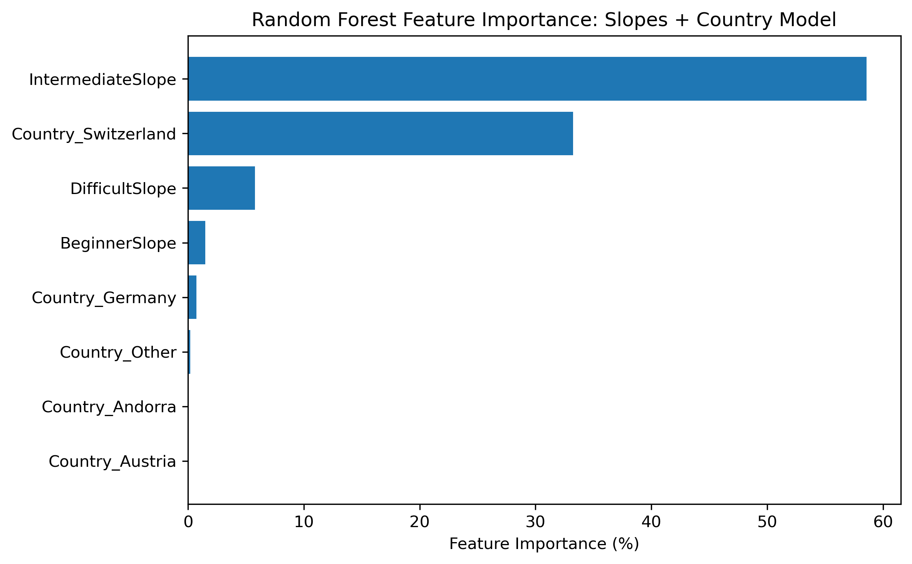
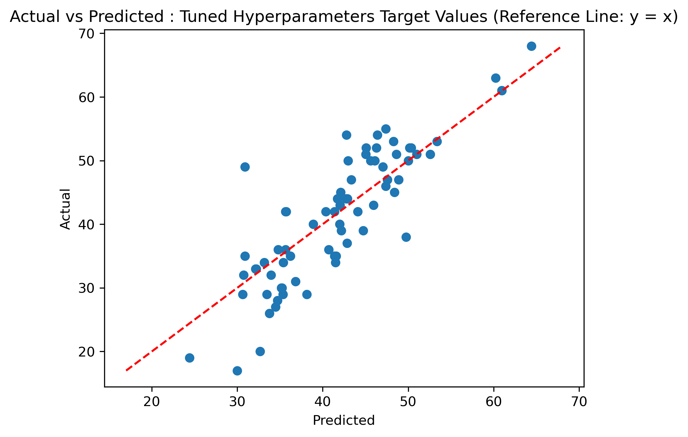
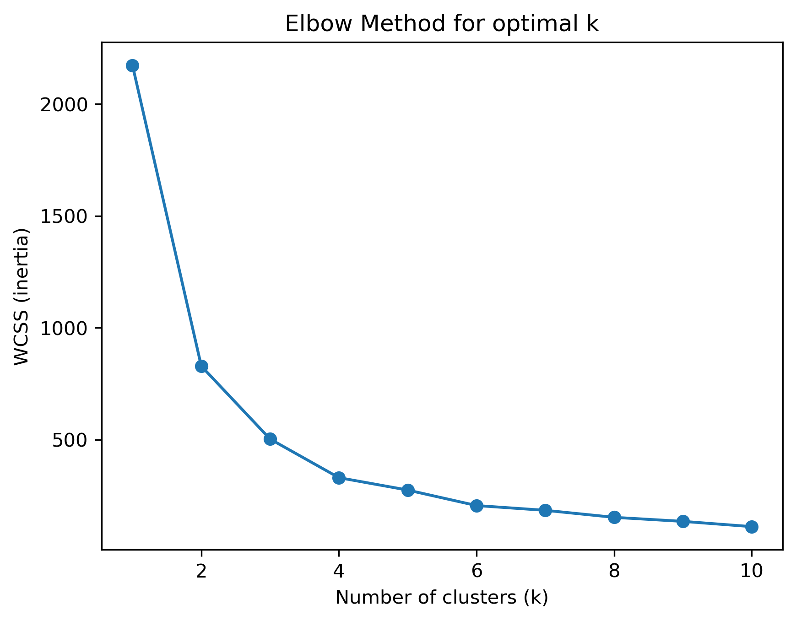
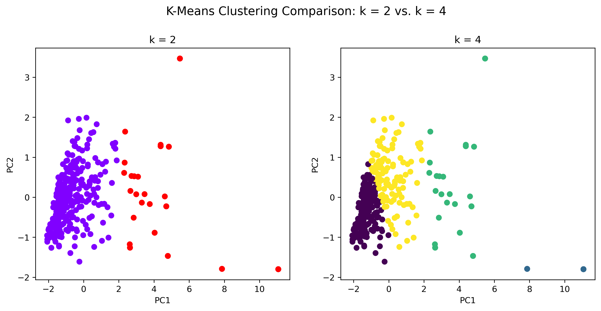
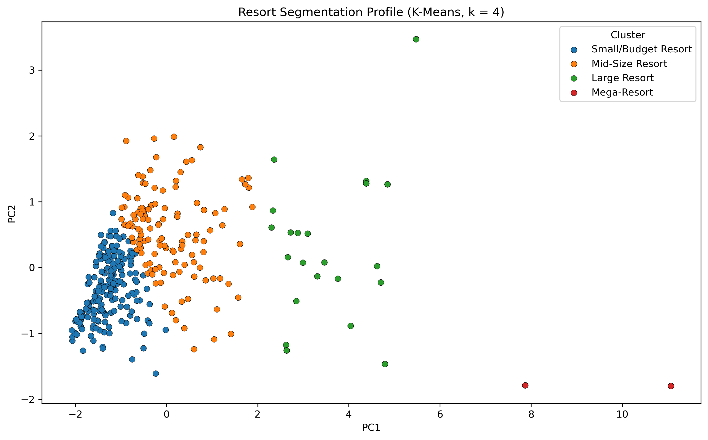
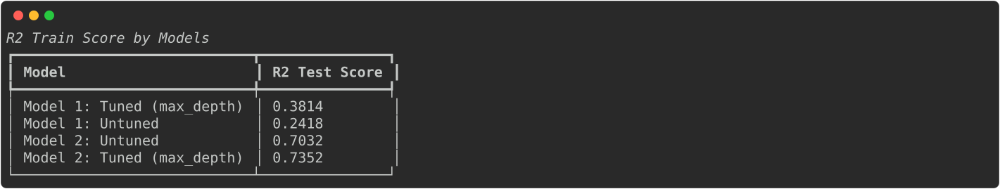

# Final Report

## 1. Detailed EDA & Preprocessing Decisions
- **Data Cleaning:** Filtered out edge cases, including dropping resorts where `TotalSlope == 0` since non-operational or zero-slope entries offer no signal for price modeling.
- **Distribution & Correlation Analysis:** Evaluated the distributions of elevation, slope counts (Beginner, Intermediate, Difficult), lift capacities, and day pass prices across 27 European countries. Identified strong correlations between resort scale andterrain difficulty and adult day pass pricing, with notable price baseline differences across country borders.

## 2. Unsupervised Learning Approach & Findings
### Feature Selection
Selected physical resort scale and terrain metrics (slope lengths, total slopes, lifts, elevation range) to identify natural groupings independent of pricing.

### PCA (Principal Component Analysis)
Applied PCA to reduce feature dimensionality, capturing the majority of structural variance across resorts while eliminating multi-collinearity among physical scale metrics.

### K-Means Clustering & Cluster Interpretation
- Applied K-Means ($k=4$) to segment resorts into four distinct operational tiers: **Small-Budget**, **Midsize**, **Large**, and **Mega Resorts**.
- **Insight:** Clustering established a natural baseline for resort scale, making it clear which specific resorts price above or below their physical peer group.

## 3. Supervised Models Tested & Compared
### Before building either mode, a handful of resorts with TotalSlope ==0 were dropped from the dataset, since a resort with no recorded slopes did not provide any benefit for a model to investigate how slope counts could relate to day pass price.

Model 1: Slopes-Only Random Forest
As we were interested in determining whether number of slopes has any impact on the day pass price, I selected 'BeginnerSlope', 'IntermediateSlope' and 'DifficultSlope' values to be included as the features and referenced as 'X' for our independent variable.

Model 2: Slopes + Country Random Forest
Building on Model 1, the 'Country' column was one-hot encoded into dummy variable to test whether resort location also impacted day pass price, with countries having fewer than 5 resorts grouped into an 'Other' category to avoid overly sparse features. These dummy variables were added to the slope features to build the second model.

Model Comparison
The R2 score tells us how much variance the model explains on unseen data. Adding the country specific feature drastically improved the test R2 score as this represented the unseen data. Comparing Model 1 (Slopes-Only Random Forest) to Model 2 (Slopes + Country specific Random Forest), we observe that Model 1's R2 test score increased from .3814 to Model 2's R2 test score of .7352, when we accounted for max_depth. We also observed with country specific feature were added to the model, there was a reduction in overfitting.

While R2 was able to tell us about variance in our model's evaluation, we needed to see how much of an improvement our prediction were through RMSE (Root Mean Squared Error). In Model 1, the RMSE was 8.27, whereas Model 2, RMSE improved to 6.9178.

Furthermore, Mean Absolute Error (MAE) provides another lens to see how accurate our model's predictions. On average, Model's 2 MAE was off by about 5.41 EUR, whereas Model 1's MAE was off by 6.274 EUR, which represents a 12.93% MAE error for Model 2 and 15% for Model 1.

Feature Engineering
- Target Variable: Adult Day Pass Price (EUR).
- One-Hot Encoding: Encoded `Country` into dummy variables, grouping countries with fewer than 5 resorts into an `'Other'` category to prevent feature sparsity.

### Model 1: Slopes-Only Random Forest
- **Features:** `BeginnerSlope`, `IntermediateSlope`, `DifficultSlope`
- **Performance:** $R^2 = 0.3814$, $\text{RMSE} = 8.27$, $\text{MAE} = 6.274\text{ EUR}$ (~15% error).

### Model 2: Slopes + Country Random Forest
- **Features:** Slope breakdown + One-Hot Encoded Country features.
- **Performance:** $R^2 = 0.7352$, $\text{RMSE} = 6.9178$, $\text{MAE} = 5.41\text{ EUR}$ (~12.93% error).

### Model Comparison
Adding country-specific features significantly expanded the variance explained ($R^2$ jumped from ~0.38 to ~0.74), drastically reduced overall error (RMSE dropped by 1.35 EUR), and minimized model overfitting.

## 4. Model Selection & Rationale
While several supervised models were available to choose from, Random Forest was selected for its ensemble learning approach: it builds decision trees, each trained on a bootstrapped sample (random sampling with replacement) of the dataset and restricted to a random subset of features at each split.

Each captures a slightly different patterns in the data. The forest's final prediction is the average of all individual trees prediction which helps to minimize errors and converges towards the true underlying signal.

### Key Findings
- **Intermediate Slope Power:** Intermediate slope count is the single strongest terrain predictor of pricing power, despite beginner and intermediate slope counts showing similar physical variance in unsupervised PCA.
- **Country Weight:** Geographic location acts as a major price driver. For example, location in Switzerland accounted for ~30% of feature importance, reflecting higher base operating costs and local market pricing (€52.84 mean pass price vs. €41.83 overall average).

## 5. Detailed Results

### Key Takeaways
- Intermediate slope length is the primary driver of price.
- Country location is almost as impactful as physical terrain scale.
- Unsupervised clustering ($k=4$) successfully validates pricing tiers against physical scale baselines.

## 6. Dashboard Interpretation
- **EDA Dashboard:** Demonstrates positive skewness in day pass prices and illustrates how pricing scales with total slope kilometer distribution across regions.
- **Supervised Model Dashboard:** Highlights feature importance weights, demonstrating the dominating influence of intermediate terrain and Switzerland dummy variables on price predictions.
- **Unsupervised Cluster Dashboard:** Visualizes the 4 resort segments along PCA axes, allowing side-by-side comparisons of physical scale vs. actual pass price.
- **Summary Dashboard:** Triangulates model predictions against cluster peer groups to flag underpriced or overpriced individual resorts.

## 7. Limitations
- **Omitted Variables:** Lacks operational costs, seasonal snow conditions, luxury amenities, lodging density, and real-time demand data, which strongly influence pass pricing.
- **Geographic Representation:** Sparser data for smaller European countries required grouping them into an `'Other'` category, losing localized pricing nuances for minor markets.
- **Tree Interpretation:** While feature importances are clear, tree-based ensembles lack direct coefficient interpretations compared to linear models.

## 8. Recommendations
- **Tiered Pricing Strategy:** Align day pass pricing with physical peer groups identified in K-Means clustering before setting regional pricing.
- **Capital Investment Prioritization:** Expand intermediate terrain over beginner/difficult terrain when looking to increase pricing power, as market data demonstrates the highest elasticity for intermediate slopes.
- **Regional Dynamic Pricing:** Factor local economic benchmarks into model baselines when expanding into high-cost regions like Switzerland.
